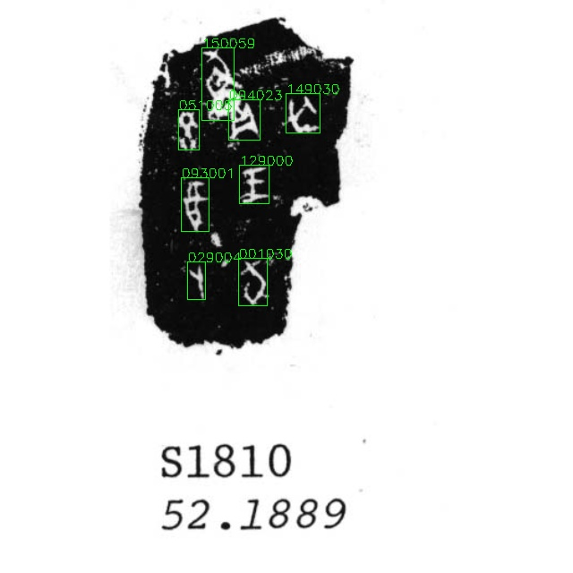
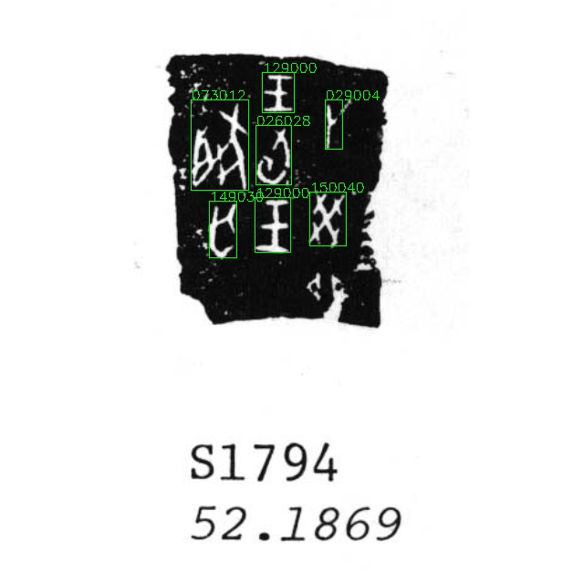

# Bone Scripts

**本项目取材自 2024 年 MathorCup 数学应用挑战赛 B 题，基于 YOLOv8 的甲骨文原始拓片图像单字分割识别模型。**

## 项目简介

针对原始拓片图像中的甲骨文文字分割识别包括以下两个阶段：

- 目标检测：基于 YOLOv8 目标检测模型，对甲骨文文字所在的矩形区域进行提取。

- 字符识别：基于 YOLOv8 图像分类模型，对文字图像进行分类，判断该字形所代表的具体字符内容。

## 效果展示

  

## 性能评估

本项目训练数据集来自 [殷契文渊](https://jgw.aynu.edu.cn/)，对原始数据集进行了数据清洗和图像增强，采用 YOLOv8s 模型进行训练，能识别 195 中不同的甲骨文字符，其中目标检测模型各项指标如下：

| mAP50 | mAP50-95 | Precision | Recall |
|:-----:|:--------:|:---------:|:------:|
| 0.928 | 0.608    | 0.905     | 0.865  |

字符分类模型各项指标如下：

| Top1_acc | Top5_acc |
|:--------:|:--------:|
| 0.897    | 0.969    |

在 640x640 的图像输入下，采用 PyTorch 平均推理一张图片的耗时约为 190ms，采用 ONNX Runtime 推理平均耗时约为 120ms（CPU：11th Intel Core i5-1155G7 2.50GHz，Model：YOLOv8s）。

## 使用说明

首先安装环境依赖包，项目目前采用 ONNX Runtime 部署模型。

```bash
pip install -r requirements.txt
```

若需要使用 GPU 进行推理，则需要安装：

```bash
pip install onnxruntime-gpu
```

待识别图像默认在 <u>tests/images/</u> 下 ，识别结果默认保存在 <u>tests/results/</u> 下，如果不存在请先创建。将所有待识别的图像放入待识别图像目录下，在本项目 Releases 中下载我训练好的模型权重文件，解压到项目中相应的位置，运行 main.py 即可。

```bash
python main.py
```

本项目识别程序的默认配置文件为 <u>configs/config.yaml</u>，其中各个属性对应的含义如下：

```yaml
device: "CPU"        # 推理设备，CPU"" 或 "GPU""
precision: "fp32"    # 推理运算精度，"fp32"（单精度）或 "fp16"（半精度）

conf-threshold: 0.25   # 目标检测置信度阈值
iou-threshold: 0.45    # 目标检测非极大值抑制 IoU 阈值

script-codes: [
    # 字符分类编码列表，包含所有字符类别对应的标签
]
```

如果需要使用自己的数据集训练模型，则需要安装 ultralytics 框架，参照 [Ultralytics 官方文档](https://docs.ultralytics.com/) 进行模型的训练，最后将模型转换为 ONNX 格式进行部署即可。

```bash
pip install ultralytics
```

*<u>说明：这个项目和我另一个 [交通信号灯识别](https://github.com/LIU42/PassingRules) 的项目原理非常类似，但我还是把参赛时写的程序整理出来放在这里，未来考虑封装一个带有交互式图像预处理的识别器前端。</u>*
